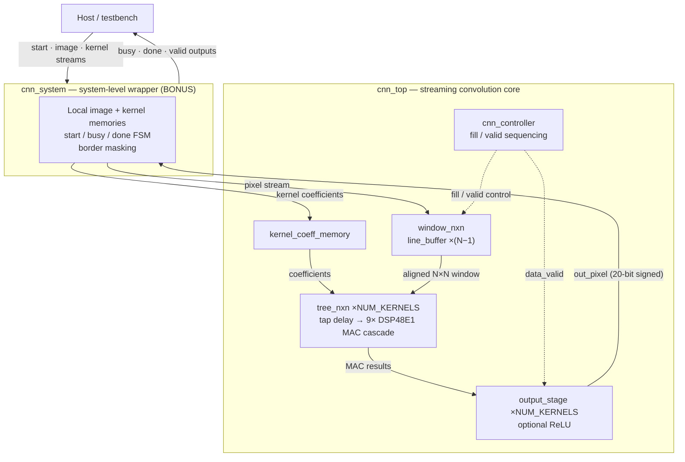
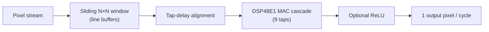

<div align="center">

# Streaming CNN Accelerator on Xilinx Zynq-7020

**Parameterized N×N 2-D convolution core · DSP48E1 MAC cascade · 390.625 MHz routed operating point**


*Developed for the IEEE SSCS Egypt Chapter 2026 Student Design Competition*

</div>

---

## Overview

This repository contains a **streaming 2-D convolution (CNN) accelerator** for the Xilinx Zynq-7020, built by **Team FlipFlopers — Cairo University** for the IEEE SSCS Egypt Chapter 2026 Student Design Competition.

The core streams a 32×32 8-bit grayscale image, convolves it with a runtime-programmable 8-bit signed kernel (stride 1, valid convolution, full-precision signed accumulation), optionally applies ReLU, and sustains **one output pixel per cycle** in steady state. Everything is parameterized — kernel size (N = 3…7), image width, ReLU enable, and `NUM_KERNELS = 1…3` — and the RTL is verified **bit-exactly** against a Python golden model across 21 regression configurations.

**Baseline configuration:** N=3, W=32, ReLU enabled, `NUM_KERNELS=1`, synthesized and routed on **xc7z020clg400-1**.

## Final Results (baseline, post-route)

| Metric | Baseline |
|---|---|
| FPGA | Xilinx Zynq-7020 |
| Device | xc7z020clg400-1 |
| Kernel | 3×3 |
| Image | 32×32 |
| Input | 8-bit unsigned |
| Kernel coefficients | 8-bit signed |
| ReLU | Enabled — Bonus Feature |
| Parallel kernels | 1 |
| LUTs | 51 |
| FFs | 97 |
| DSP48E1 | 9 |
| BRAM | 0 |
| Total Power | 0.134 W |
| WNS | +0.007 ns |
| Clock Constraint | 2.56 ns |
| MAX FREQ | 390.625 MHz |
| Throughput | 1 pixel/cycle — Bonus Target |
| FOM | 0.01490 |
| Verification | 2596/2596 PASS |


## Competition Bonus Features

### ReLU — Bonus Feature
Optional rectification (`RELU_EN` parameter) applied in `output_stage`. It is free in time: **ReLU adds no extra pipeline cycle** in the current implementation.

### One Output Pixel per Cycle — Bonus Target
The streaming datapath (line buffers → sliding window → tap-delay alignment → DSP48E1 cascade) produces one result pixel every clock cycle in steady state.

### Parallel Multi-Kernel Support — Bonus Feature
`NUM_KERNELS = 1..3` kernels run in parallel. The **window generator and controller are shared**, while the MAC engine (`tree_nxn`) and output stage are **replicated per kernel**, multiplying throughput without duplicating the input plumbing.

### System-Level Integration — Bonus Feature
`cnn_system` wraps `cnn_top` with **local image and kernel memories** and a **start/busy/done FSM** (no AXI), streaming a full frame on-chip and masking border pixels. It is verified by a separate dedicated testbench (below).


## Architecture

Data flow: **input stream → line buffers (`line_buffer` ×(N−1)) → N×N sliding window (`window_nxn`) → triangular tap-delay alignment → 9 parallel multipliers (one DSP48E1 per tap) → accumulation cascade inside the DSP columns (`tree_nxn`) → optional ReLU (`output_stage`) → output**.

For N=3 there are 9 taps and 9 DSP48E1 blocks; accumulation stays in the DSP cascade, which is what keeps fabric utilization at 51 LUTs while sustaining 1 pixel/cycle.



Datapath widths for the N=3 configuration (one DSP48E1 per tap):


Compact dataflow view:



## Throughput and Latency

The pipeline is fully parameterized:

```text
FILL                 = (N-1)(W+1)
PIPELINE_LATENCY     = N^2 + 1
FIRST_OUTPUT_LATENCY = FILL + PIPELINE_LATENCY
                     = (N-1)(W+1) + (N^2+1)
```

Baseline (N=3, W=32):

| Stage | Cycles |
|---|---|
| Fill (window priming) | 66 |
| Pipeline latency | 10 |
| **First output pixel** | **76** |

Steady-state throughput is **1 output pixel/cycle — competition bonus target**. ReLU adds no extra pipeline cycle.


## Fixed-Point Number Format

Full precision end-to-end — **no truncation, no rounding, no saturation**:

| Signal | Format |
|---|---|
| Pixel input | 8-bit unsigned |
| Kernel coefficient | 8-bit signed |
| Product | 17-bit signed |
| Accumulator / output (N=3) | 20-bit signed |

The 20-bit output width equals `2·PIXEL_BITS + clog2(N²)` = 2·8 + clog2(9), so every possible accumulation value is representable.

## Verification

Layered, self-checking verification flow:

```text
Python Golden Model → Expected Output File → RTL Testbench → Structural Mirror
→ Closed-Form Law Check → Exact Strobe Counting → Protocol Guards
→ RTL vs Python Comparison
```

- **Python golden model** (`python/golden_model.py`, pure Python 3) generates all 21 golden output files in `expected_outputs/`.
- The **RTL testbench** mirrors the RTL structure, checks internal arithmetic against closed-form laws, counts valid strobes exactly, and guards the output protocol (no X, no spurious valids).
- Final verdict: **RTL vs Python golden comparison**.

**Core baseline result (N=3, W=32, ReLU=1, NUM_KERNELS=1): 2596/2596 output pixels matched — zero mismatches, zero X in valid windows — PASS.**


### Verification Matrix

| N | IMG_WIDTH | ReLU | NUM_KERNELS | Result |
|---|---|---|---|---|
| 3 | 32 | 0 | 1 | PASS |
| 3 | 64 | 0 | 1 | PASS |
| 4 | 32 | 0 | 1 | PASS |
| 5 | 32 | 0 | 1 | PASS |
| 7 | 32 | 0 | 1 | PASS |
| 3 | 8 | 0 | 1 | PASS |
| 3 | 32 | 1 | 1 | PASS |


### System-Level Verification — Separate Test

The bonus system wrapper is verified independently of the core regression above:

| Item | Value |
|---|---|
| Configuration | N=3, W=32, ReLU disabled |
| Input | 1024 pixels streamed into on-chip memory |
| Kernel | 9 coefficients |
| Completion | `done = 1` |
| Valid outputs | 900 ((W−N+1)² = 30×30 border-masked pixels) |
| Result | **PASS** |


## Design-Space Exploration

A DSP-free fabric multiplier/accumulator reference was implemented to validate the multiplier decision. **Each architecture is evaluated at its own routed MAX-FREQ operating point** (the DSP design closes 2.56 ns; the fabric reference closes 143 MHz).

| Architecture | LUTs | FFs | DSPs | MAX FREQ | Power | FOM |
|---|---|---|---|---|---|---|
| **DSP48E1-based (selected)** | 51 | 97 | 9 | 390.625 MHz | 0.134 W | **0.01490** |
| DSP-free fabric reference | 792 | 441 | 0 | 143 MHz | 0.125 W | 0.01010 |

DSP usage was **intentionally retained**: the DSP-based design uses ~15× fewer LUTs, runs at ~2.7× the frequency, and achieves a better FOM.


## Timing

| Item | Value |
|---|---|
| Clock constraint | 2.56 ns |
| MAX FREQ operating point | 390.625 MHz |
| WNS | +0.007 ns |
| WHS | +0.175 ns |
| Failing endpoints | 0 |

**Note:** 390.625 MHz is the *selected routed MAX-FREQ operating point* for the 2.56 ns constraint — it is **not** derived by subtracting WNS from the target period. WNS (+0.007 ns) is timing margin only. The XDC exempts I/O timing (false paths on non-clock I/O); it is a core-Fmax benchmarking constraint, not board bring-up.


## Power

| Component | Value |
|---|---|
| Total on-chip power | 0.134 W |
| Static | 0.105 W |
| Dynamic | 0.029 W |

These are **Vivado tool estimates, not silicon measurements**. Confidence is low because no SAIF / simulation-annotated switching activity was captured for the power run.


## Implementation View

Post-route placement of the 51-LUT / 9-DSP baseline on xc7z020clg400-1:


<details>
<summary><strong>Evidence gallery — architecture, microarchitecture, and reports</strong></summary>

| | |
|---|---|
|  |  |
|  |  |
|  |  |
|  |  |
|  |  |
|  |  |

</details>

## Project Structure

```text
.
├── rtl/                          # 7 synthesizable Verilog-2001 modules (top: cnn_top)
│   ├── cnn_top.v                 #   streaming convolution core top
│   ├── cnn_controller.v          #   fill / valid sequencing FSM
│   ├── kernel_coeff_memory.v     #   runtime-programmable kernel loader
│   ├── line_buffer.v             #   row delay line (DEPTH = IMG_WIDTH - N)
│   ├── window_nxn.v              #   N×N sliding window (instantiates line_buffer ×(N−1))
│   ├── tree_nxn.v                #   tap-delay + DSP48E1 MAC cascade (×NUM_KERNELS)
│   └── output_stage.v            #   optional ReLU + output gating (×NUM_KERNELS)
├── tb/
│   └── cnn_top_tb.v              # self-checking core testbench (golden-file comparison)
├── sim/                          # 21 ModelSim regression scripts + modelsim.ini
│   ├── run_3x32relu_k1.do        #   baseline regression (N=3 W=32 ReLU=1 K=1)
│   └── run_<N>x<W>[relu]_k<K>.do #   remaining 20 configurations
├── system/                       # BONUS system-level integration
│   ├── cnn_system.v              #   wrapper: local memories + start/busy/done FSM
│   ├── cnn_system_tb.v           #   system testbench
│   └── run.do                    #   system simulation script
├── constrains/
│   └── timing_constraints.xdc    # 2.56 ns clock constraint, I/O settings
├── python/
│   └── golden_model.py           # pure-Python-3 golden reference model
├── expected_outputs/             # 21 golden output vector files (generated by golden_model.py)
│   └── expected_out_<N>x<W>_relu<R>_k<K>.txt
├── freq_sweep/                   # Vivado MAX-FREQ characterization sweep (fixed 2.56 ns)
│   ├── max_freq_sweep.tcl        #   21-run synthesis + implementation batch script
│   ├── max_freq_results.csv      #   summary: LUT/FF/DSP/BRAM/power/WNS/FOM per run
│   └── runs/                     #   per-run clocks/timing/utilization/power reports
├── doc/
│   └── AI_Accelerator_Report.pdf # full project report
├── images/                       # 25 evidence figures
├── _regress.log                  # 7/7 PASS RTL regression summary log
├── README.md
└── .gitignore
```

## How to Run

Prerequisites: **Python 3**, **ModelSim** (Intel FPGA Edition), **Xilinx Vivado**. All paths below are relative to the repository root.

### 1. Python golden model

```bash
cd python
python golden_model.py
```

Plain Python 3 — no third-party packages. Regenerates all 21 expected-output files in `expected_outputs/`.

### 2. RTL simulation (ModelSim)

```bash
cd sim
vsim -do run_3x32relu_k1.do
```

Each `run_*.do` script compiles `../rtl/*.v` and `../tb/cnn_top_tb.v` into `work`, then runs `work.cnn_top_tb` with `-g` parameter overrides (baseline: `-gN=3 -gIMG_WIDTH=32 -gRELU_EN=1 -gNUM_KERNELS=1 -gPIXEL_BITS=8`). The testbench loads its golden vectors from `expected_outputs/` and prints the RTL-vs-Python verdict. The other 20 scripts run the remaining configurations the same way.

### 3. System-level wrapper simulation

```bash
cd system
vsim -do run.do
```

Compiles the RTL plus `cnn_system.v` / `cnn_system_tb.v` and prints the system test verdict.

### 4. Vivado synthesis / implementation / reports (MAX-FREQ sweep)

```bash
cd freq_sweep
vivado -mode batch -source max_freq_sweep.tcl
```

Runs the complete 21-run sweep (7 configurations × `NUM_KERNELS` ∈ {1,2,3}): per run it reads `../rtl/*.v`, runs `synth_design -top cnn_top` with generics on **xc7z020clg400-1**, applies the fixed **2.56 ns** operating point, runs `opt_design → place_design → phys_opt_design → route_design`, and writes per-run timing/utilization/power/clock reports under `runs/`, plus the summary `max_freq_results.csv`.

## Reproducibility Notes

- **FPGA part:** xc7z020clg400-1, fixed in `max_freq_sweep.tcl` and in the checked-in reports.
- **Baseline parameters:** N=3, IMG_WIDTH=32, PIXEL_BITS=8, RELU_EN=1, NUM_KERNELS=1.
- **Tool versions:** the archived runs in this repository were produced with **Vivado v2019.1 (SW Build 2552052)** and **ModelSim – Intel FPGA Edition 2020.1** (per the run logs of the original project environment). The final report (`doc/AI_Accelerator_Report.pdf`) cites the **Vivado 2026** toolchain for the submission build. Both facts are stated as-is.
- **Source-controlled inputs:** all RTL, testbenches, sim/system scripts, the XDC, the Python golden model, all 21 golden expected-output files, the sweep TCL + CSV + per-run reports, the report PDF, and the evidence images.
- **Generated artifacts** (ModelSim `work/` libraries, `*.wlf`, transcripts, Vivado journals/logs/backups) are intentionally **not** committed — they are rebuilt by the commands above and covered by `.gitignore`.
- **No Vivado `.xpr` projects are included.** The original `.xpr` files were stale — they referenced sources at a `../rtl_2/` directory that no longer exists — and were deliberately excluded. The headless flows above (`sim/*.do`, `system/run.do`, `freq_sweep/max_freq_sweep.tcl`) fully replace them.
- **What is reproducible from this repo:** golden-vector generation, all 21 RTL regressions, the system-wrapper test, and the full 21-run synthesis/implementation/report sweep. **What is not:** a one-click Vivado GUI project (not shipped), and board-level I/O timing (the XDC false-paths I/O by design).

## Tools & Technologies

| Tool | Role |
|---|---|
| Verilog-2001 | RTL (all 10 HDL files; no SystemVerilog constructs) |
| Python 3 | Golden reference model + golden-vector generation |
| ModelSim (Intel FPGA Edition) | RTL + system-level simulation |
| Xilinx Vivado | Synthesis, implementation, timing/utilization/power reports |
| Xilinx Zynq-7020 (xc7z020clg400-1) | Target FPGA; DSP48E1 MAC cascade |
| Tcl | Vivado batch sweep flow |

## Team — FlipFlopers, Cairo University

| Name | GitHub | Email |
|---|---|---|
| Ahmed Badwy | [@ahmedbadwy77](https://github.com/ahmedbadwy77) | — |
| Ahmed Amir | [@ahmedamir10](https://github.com/ahmedamir10) | Ahmed.hamdy04@eng-st.cu.edu.eg |
| BadrEldin Hossam | [@Badreldin1salama](https://github.com/Badreldin1salama) | salamabadreldin@gmail.com |

## License

License: not specified.

## Full Report

The complete design, verification, DSE, and results write-up is in **[`doc/AI_Accelerator_Report.pdf`](doc/AI_Accelerator_Report.pdf)**.
