<div align="center">

# Streaming CNN Accelerator on Xilinx Zynq-7020

**Parameterized N×N 2-D convolution core · DSP48E1 MAC cascade · 390.625 MHz routed operating point**

[](rtl/)
[](python/golden_model.py)
[](freq_sweep/)
[](sim/)
[](https://www.amd.com/en/products/adaptive-socs-and-fpgas/zynq-7000-series.html)
[](doc/2026_SSCS_Egypt_Competition_Announcement.pdf)
[](LICENSE)
[](../../actions/workflows/golden-model.yml)

*Developed for the IEEE SSCS Egypt Chapter 2026 Student Design Competition*

</div>

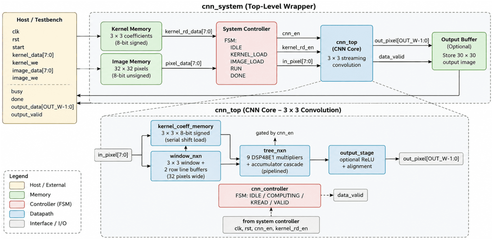

## At a Glance

| LUTs | FFs | DSP48E1 | BRAM | MAX FREQ | Power | Throughput | FOM | Verification |
|:-:|:-:|:-:|:-:|:-:|:-:|:-:|:-:|:-:|
| **51** | **97** | **9** | **0** | **390.625 MHz** | **0.134 W** | **1 pixel/cycle** | **0.01490** | **2596/2596** |

Bit-exact against an independent Python golden model across **21 regression configurations** (7 kernel/image/ReLU settings × 1–3 parallel kernels), routed and timed on `xc7z020clg400-1`.

## Competition Context

This accelerator is Team **FlipFlopers**' (Cairo University) entry for the **IEEE SSCS Egypt Chapter 2026 Student Design Competition** — an FPGA-based Edge-AI vision accelerator judged on correctness, digital design quality, resource usage, latency, throughput, timing closure, and power estimate. Submission deadline: **September 15, 2026** ([announcement](doc/2026_SSCS_Egypt_Competition_Announcement.pdf)).

## Competition Requirements Coverage

Format follows the required reporting table of the competition announcement.

| Parameter | Specification (competition) | Team Result | Units | Comments |
|---|---|---|---|---|
| Input image size | ≥ 32×32, grayscale / single-channel | 32×32 baseline; width parameterized | pixels | image widths 8/32/64 exercised in regression & sweep |
| Input precision | Fixed-point unsigned (justify choice) | 8-bit unsigned | — | full-precision integer datapath; no input quantization |
| Kernel precision | 8-bit signed fixed-point / integer | 8-bit signed two's complement | — | run-time programmable coefficients |
| Kernel size | N×N, programmable coefficients | N=3 baseline; RTL verified N=3…7 | — | serial kernel load, reload between bursts |
| Stride | 1 | 1 | — | valid convolution |
| Output precision | ≥ 16-bit signed; explain overflow policy | 20-bit signed (N=3); OUT_W = 2·8 + ⌈log₂N²⌉ | bits | overflow **impossible by construction** (worst case 9×32,640 = 293,760 < 20-bit capacity 524,287); no truncation, rounding, or saturation anywhere |
| Activation (ReLU) | Optional — **bonus** | Implemented (`RELU_EN`), enabled in baseline | — | compile-time clamp; adds **no extra pipeline cycle** |
| Architecture type | Streaming datapath (describe buffers/windowing) | Fully streaming: line buffers + sliding window | — | N−1 = 2 row line buffers, depth W−N = 29, SRL-mapped |
| Multipliers / MACs | N² per kernel | 9 × DSP48E1 (K=1), ×K for parallel kernels | slices | multiply **and** accumulate inside the DSP cascade |
| Pipeline stages | Pipelined convolution | Registered multiply + N²-stage cascade | — | staggered accumulation, absorbed by fill period |
| Latency | — | **76 cycles** to first output pixel | cycles | FILL 66 + pipeline 10; equations parameterized by N, W |
| Throughput | 1 pixel/cycle — **bonus** | **Met** | pixels/cycle | steady state; `NUM_KERNELS` replicates MAC/output per kernel |
| FPGA utilization | LUTs / FFs / DSPs / BRAMs | **51 / 97 / 9 / 0** (routed) | — | `freq_sweep/runs/run_19_N3_W32_R1_K1_MAXFREQ/` |
| Maximum frequency | Report | **390.625 MHz** at 2.56 ns constraint; WNS +0.007 ns, 0 failing endpoints | MHz | selected routed MAX-FREQ operating point — not derived from WNS |
| Power estimate | Report | **0.134 W** (0.105 static + 0.029 dynamic) | W | Vivado tool estimate, low confidence (no SAIF switching activity) |
| Verification status | Golden model (Python/MATLAB/C) | Python golden model — **2596/2596 bit-exact**, 7/7 matrix, 900-output system test | — | zero mismatches, zero X in valid windows |
| FOM | Required formula | **0.01490** | — | 1 / [0.134 × (51 + 50×9 + 100×0)] |

## Architecture

Data flow: **input stream → line buffers (`line_buffer` ×(N−1)) → N×N sliding window (`window_nxn`) → triangular tap-delay alignment → 9 parallel multipliers (one DSP48E1 per tap) → accumulation cascade inside the DSP columns (`tree_nxn`) → optional ReLU (`output_stage`) → output**.

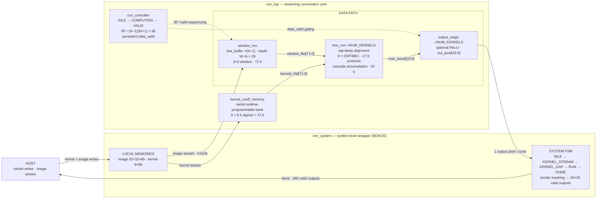
```mermaid
flowchart LR
    HOST["HOST<br/>kernel writes · image stream"]

    subgraph SYS["cnn_system — system-level wrapper (BONUS)"]
        direction LR
        MEM["LOCAL MEMORIES<br/>image 32×32×8b · kernel 9×8b"]
        SYSFSM["SYSTEM FSM<br/>IDLE → KERNEL_STREAM → KERNEL_GAP → RUN → DONE<br/>border masking → 30×30 valid outputs"]
    end

    subgraph CORE["cnn_top — streaming convolution core"]
        direction LR
        subgraph DPATH["DATA PATH"]
            direction LR
            WIN["window_nxn<br/>line_buffer ×(N−1) · depth W−N = 29<br/>3×3 window · 72 b"]
            MAC["tree_nxn ×NUM_KERNELS<br/>tap-delay alignment<br/>9 × DSP48E1 · 17 b products<br/>cascade accumulation · 20 b"]
            OUT["output_stage ×NUM_KERNELS<br/>optional ReLU · out_pixel[19:0]"]
            WIN -->|"window_flat[71:0]"| MAC
            MAC -->|"mac_result[19:0]"| OUT
        end
        KCM["kernel_coeff_memory<br/>serial runtime-programmable bank<br/>9 × 8 b signed = 72 b"]
        CTRL["cnn_controller<br/>IDLE → COMPUTING → VALID<br/>fill = (N−1)(W+1) = 66<br/>persistent data_valid"]
    end

    HOST -->|"kernel + image writes"| MEM
    MEM -->|"image stream · 8 b/clk"| WIN
    MEM -->|"kernel stream"| KCM
    KCM -->|"kernels_flat[71:0]"| MAC
    CTRL -.->|"fill / valid sequencing"| WIN
    CTRL -.->|"data_valid gating"| OUT
    OUT -->|"1 output pixel / cycle"| SYSFSM
    SYSFSM -->|"done · 900 valid outputs"| HOST
```

For N=3 there are 9 taps and 9 DSP48E1 blocks; accumulation stays in the DSP cascade, which is what keeps fabric utilization at 51 LUTs while sustaining 1 pixel/cycle. All on-chip storage maps to SRL shift registers — the design uses **zero BRAMs**.

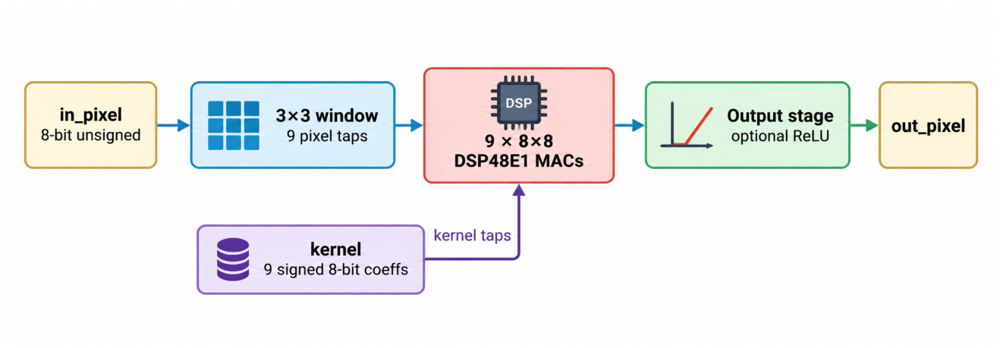

## Highlights

- **Additions cost zero LUTs.** Each tap multiplies in its own DSP48E1 and hands its running sum to the next slice through the PCOUT→PCIN cascade — the nine additions never touch fabric.
- **Zero BRAMs, minimal storage.** Line buffers and tap delays map to SRL primitives; forcing a datapath reset would re-map them to flip-flops and inflate both LUT and FF counts, so the datapath is deliberately reset-free (deterministic fill/flush protocol instead).
- **Overflow impossible by construction.** OUT_W = 16 + ⌈log₂N²⌉ signed bits strictly exceeds the worst case N²·32,640 for every N.
- **One RTL, many designs.** The same parameterized sources verify N=3…7 and K=1…3 — the sweep includes a 49-tap, 3-kernel configuration (163 LUTs, 147 DSPs) alongside the 51-LUT competition baseline.
- **Measured, not assumed.** The multiplier decision is backed by a routed DSP-free A/B build (792 LUTs, 143 MHz) that loses to the DSP design on FOM **even when each side is evaluated at its own MAX-FREQ operating point**.
- **Warm-pipeline restart.** Bursts run back-to-back without re-resetting; the persistent-valid protocol eliminates inter-burst gaps in the output stream.
- **Golden vectors under CI.** Every push regenerates all 21 expected-output files and verifies them byte-identically (badge at the top).

## Competition Bonus Features

### ReLU — Bonus Feature
Optional rectification (`RELU_EN` parameter) applied in `output_stage`. It is free in time: **ReLU adds no extra pipeline cycle** in the current implementation.

### One Output Pixel per Cycle — Bonus Target
The streaming datapath (line buffers → sliding window → tap-delay alignment → DSP48E1 cascade) produces one result pixel every clock cycle in steady state.

### Parallel Multi-Kernel Support — Bonus Feature
`NUM_KERNELS = 1..3` kernels run in parallel. The **window generator and controller are shared**, while the MAC engine (`tree_nxn`) and output stage are **replicated per kernel**, multiplying throughput without duplicating the input plumbing.

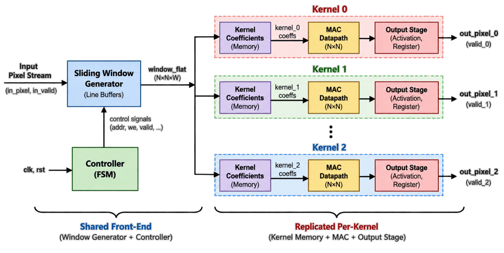

### System-Level Integration — Bonus Feature
`cnn_system` wraps `cnn_top` with **local image and kernel memories** and a **start/busy/done FSM** (no AXI), streaming a full frame on-chip and masking border pixels. It is verified by a separate dedicated testbench (below).


### Edge-Detection Demonstration — Bonus Feature

The kernel bank is **runtime-programmable**, so the same verified datapath doubles as an edge detector: load the classic 3×3 Sobel operators (8-bit signed) and stream a frame — **no RTL changes**. `demo/` contains a deterministic 32×32 test scene plus the Sobel Gx/Gy expected outputs (raw and ReLU-clamped; 30×30 = 900 outputs each), computed under the identical fixed-point contract (8u pixel / 8s kernel / 17-bit products / 20-bit full-precision accumulation — Sobel worst case 8×255 = 2,040 ≪ 2¹⁹, so overflow stays impossible).

```text
SOBEL Gx            SOBEL Gy
[-1  0  +1]         [-1 -2 -1]
[-2  0  +2]         [ 0  0  0]
[-1  0  +1]         [+1 +2 +1]
```

Regenerate with: `python edge_detection_demo.py` (see [How to Run](#how-to-run)).

## Throughput and Latency

The pipeline is fully parameterized:

```text
FILL                 = (N-1)(W+1)
PIPELINE_LATENCY     = N^2 + 1
FIRST_OUTPUT_LATENCY = FILL + PIPELINE_LATENCY
                     = (N-1)(W+1) + (N^2+1)
```

Baseline (N=3, W=32):

| Stage | Cycles |
|---|---:|
| Fill (window priming) | 66 |
| Pipeline latency | 10 |
| **First output pixel** | **76** |

Steady-state throughput is **1 output pixel/cycle — competition bonus target**. ReLU adds no extra pipeline cycle.

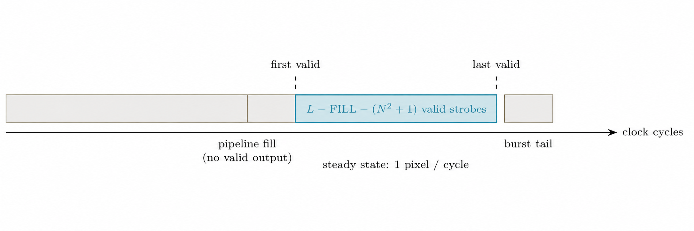

## Fixed-Point Number Format

Full precision end-to-end — **no truncation, no rounding, no saturation**:

| Signal | Format |
|---|---|
| Pixel input | 8-bit unsigned |
| Kernel coefficient | 8-bit signed |
| Product | 17-bit signed |
| Accumulator / output (N=3) | 20-bit signed |

The 20-bit output width equals `2·PIXEL_BITS + clog2(N²)` = 2·8 + clog2(9), so every possible accumulation value is representable.

## Verification

Layered, self-checking verification flow:

```text
Python Golden Model → Expected Output File → RTL Testbench → Structural Mirror
→ Closed-Form Law Check → Exact Strobe Counting → Protocol Guards
→ RTL vs Python Comparison
```

- **Python golden model** (`python/golden_model.py`, pure Python 3) generates all 21 golden output files in `expected_outputs/`.
- The **RTL testbench** mirrors the RTL structure, checks internal arithmetic against closed-form laws, counts valid strobes exactly, and guards the output protocol (no X, no spurious valids).
- Final verdict: **RTL vs Python golden comparison**.

**Core baseline result (N=3, W=32, ReLU=1, NUM_KERNELS=1): 2596/2596 output pixels matched — zero mismatches, zero X in valid windows — PASS.**

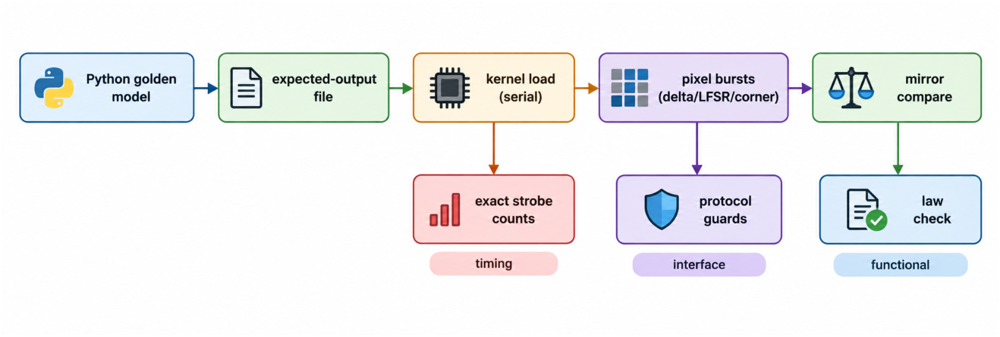

### Verification Matrix

| N | IMG_WIDTH | ReLU | NUM_KERNELS | Result |
|:-:|:-:|:-:|:-:|:-:|
| 3 | 32 | 0 | 1 | PASS |
| 3 | 64 | 0 | 1 | PASS |
| 4 | 32 | 0 | 1 | PASS |
| 5 | 32 | 0 | 1 | PASS |
| 7 | 32 | 0 | 1 | PASS |
| 3 | 8 | 0 | 1 | PASS |
| 3 | 32 | 1 | 1 | PASS |

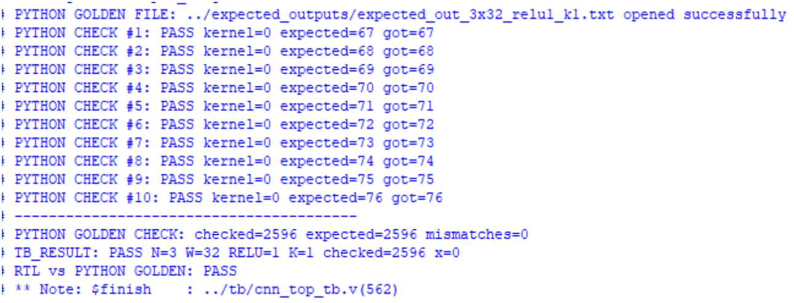

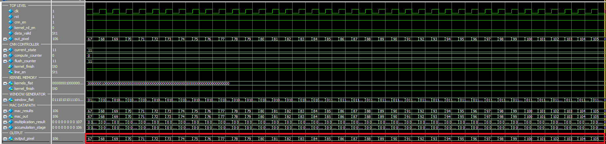

### System-Level Verification — Separate Test

The bonus system wrapper is verified independently of the core regression above:

| Item | Value |
|---|---|
| Configuration | N=3, W=32, ReLU disabled |
| Input | 1024 pixels streamed into on-chip memory |
| Kernel | 9 coefficients |
| Completion | `done = 1` |
| Valid outputs | 900 ((W−N+1)² = 30×30 border-masked pixels) |
| Result | **PASS** |

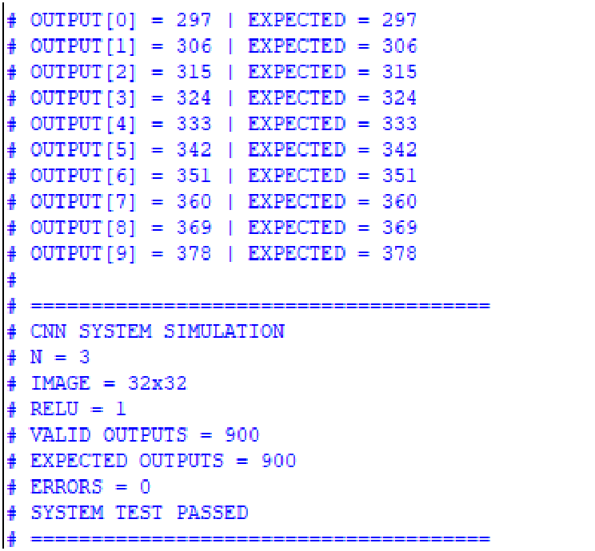

## Design-Space Exploration

A DSP-free fabric multiplier/accumulator reference was implemented to validate the multiplier decision. **Each architecture is evaluated at its own routed MAX-FREQ operating point** (the DSP design closes 2.56 ns; the fabric reference closes 143 MHz).

| Architecture | LUTs | FFs | DSPs | MAX FREQ | Power | FOM |
|---|:-:|:-:|:-:|:-:|:-:|:-:|
| **DSP48E1-based (selected)** | 51 | 97 | 9 | 390.625 MHz | 0.134 W | **0.01490** |
| DSP-free fabric reference | 792 | 441 | 0 | 143 MHz | 0.125 W | 0.01010 |

DSP usage was **intentionally retained**: the DSP-based design uses ~15× fewer LUTs, runs at ~2.7× the frequency, and achieves a better FOM.

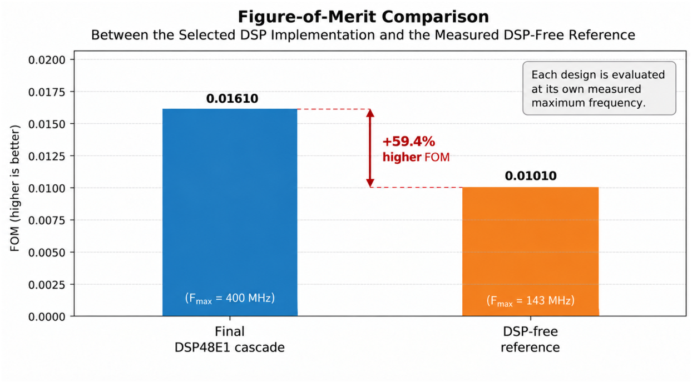

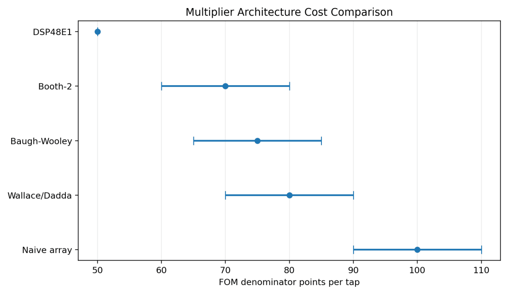

## Timing

| Item | Value |
|---|---|
| Clock constraint | 2.56 ns |
| MAX FREQ operating point | 390.625 MHz |
| WNS | +0.007 ns |
| WHS | +0.175 ns |
| Failing endpoints | 0 |

**Note:** 390.625 MHz is the *selected routed MAX-FREQ operating point* for the 2.56 ns constraint — it is **not** derived by subtracting WNS from the target period. WNS (+0.007 ns) is timing margin only. The XDC exempts I/O timing (false paths on non-clock I/O); it is a core-Fmax benchmarking constraint, not board bring-up.

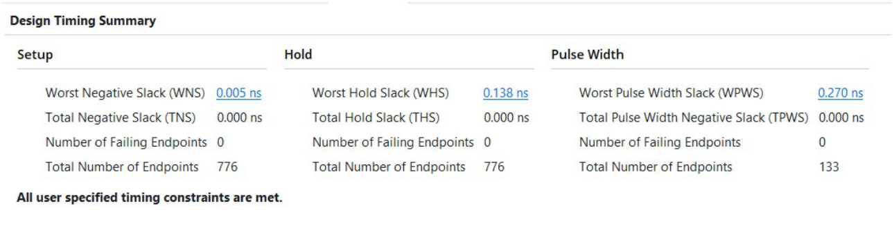

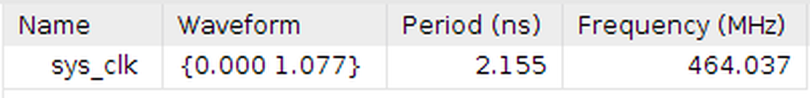

## Power

| Component | Value |
|---|---|
| Total on-chip power | 0.134 W |
| Static | 0.105 W |
| Dynamic | 0.029 W |

These are **Vivado tool estimates, not silicon measurements**. Confidence is low because no SAIF / simulation-annotated switching activity was captured for the power run.

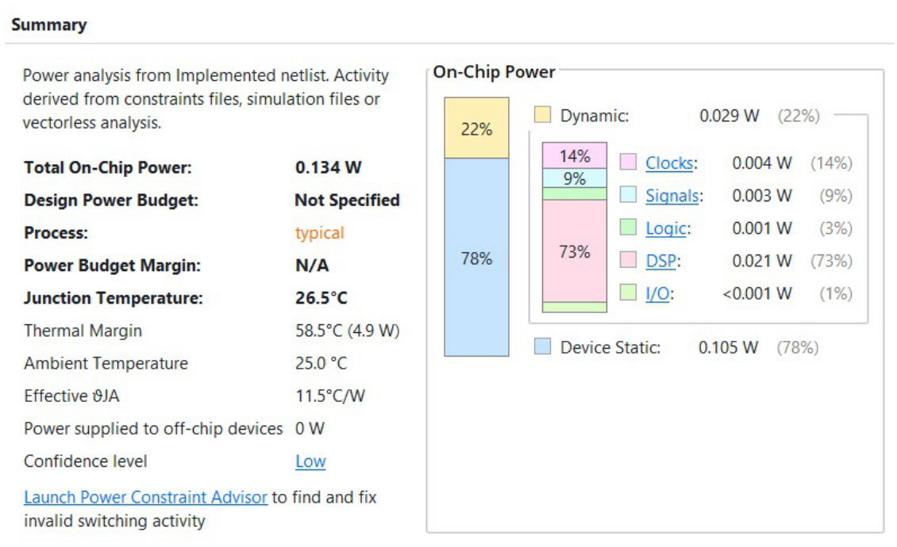

## Implementation View

Routed utilization evidence for the 51-LUT / 9-DSP / 0-BRAM baseline:

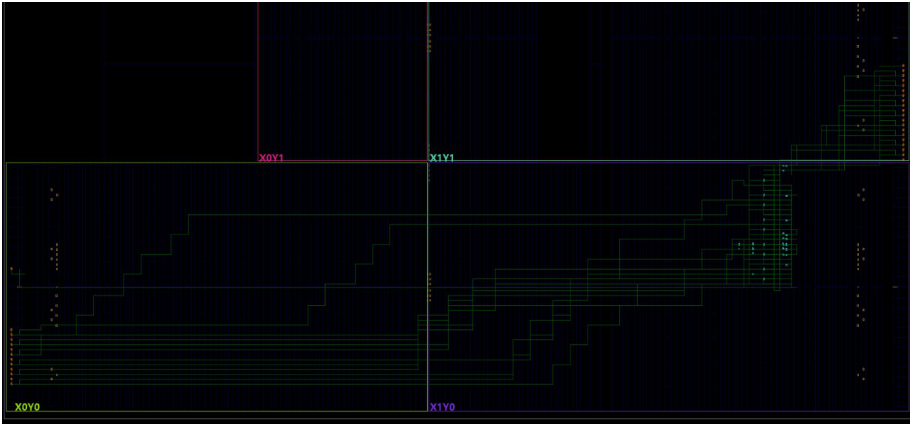

Post-route placement on xc7z020clg400-1:

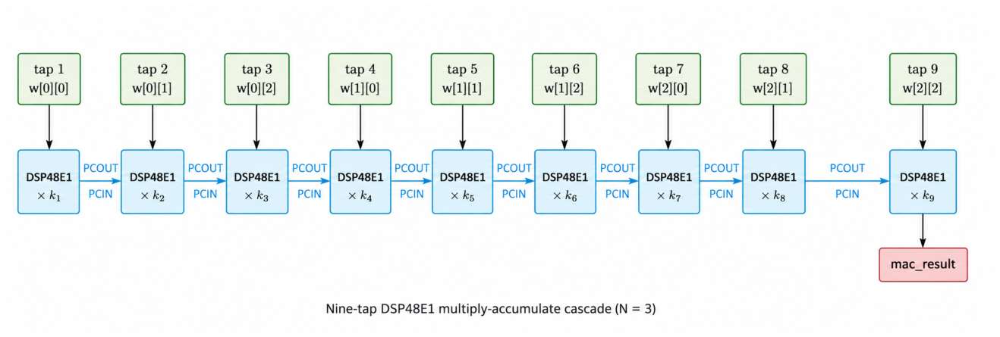

<details>
<summary><strong>Evidence gallery — architecture, microarchitecture, and reports</strong></summary>

| | |
|---|---|
| 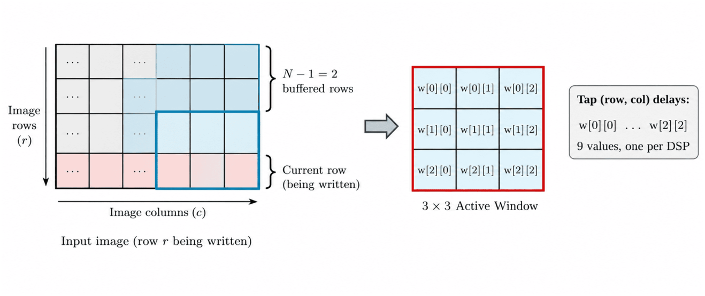 | 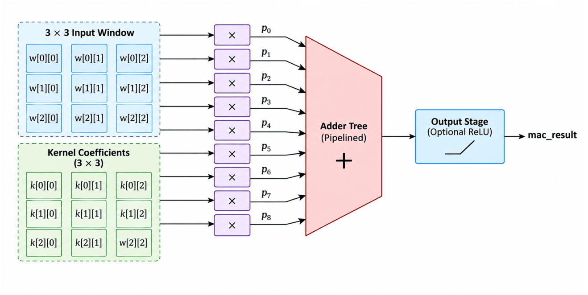 |
| 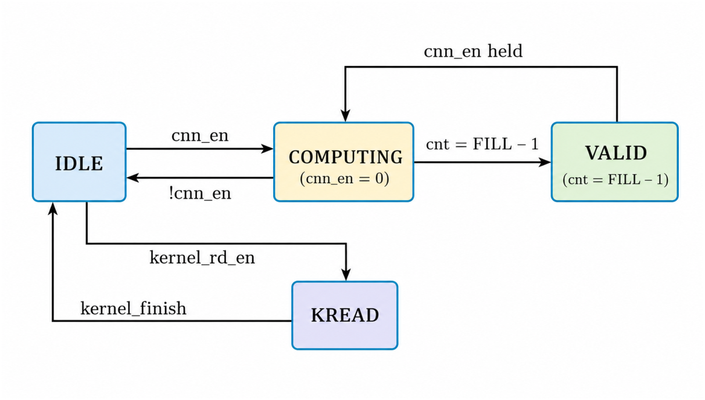 | 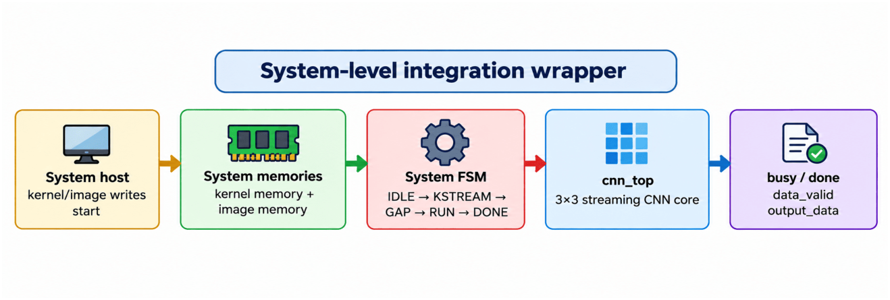 |
|  | 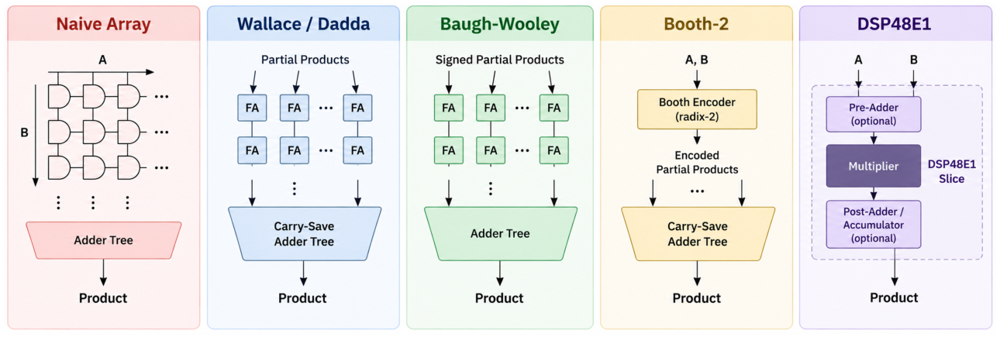 |
| 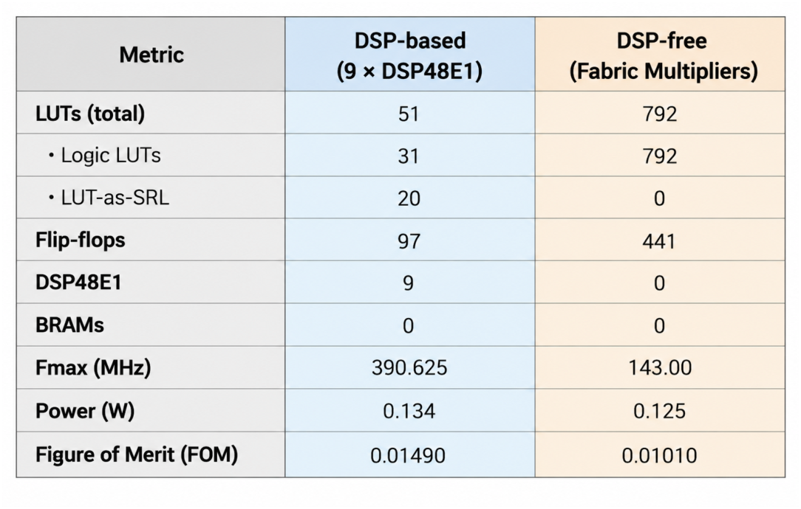 | 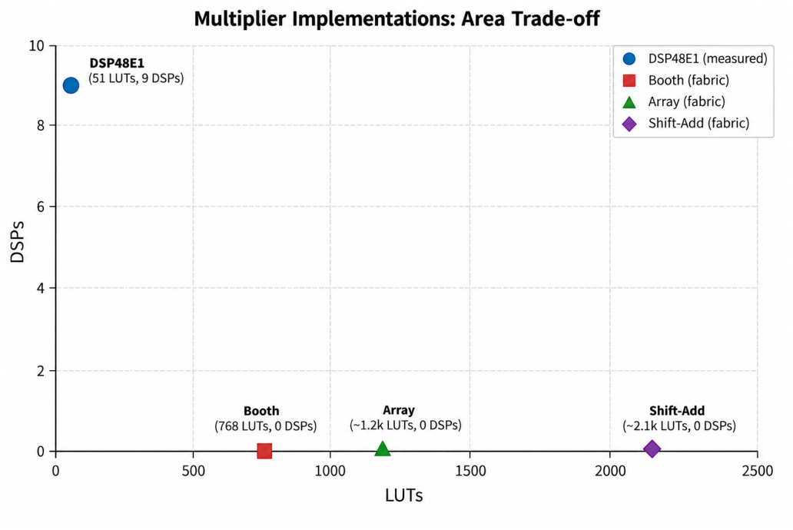 |
| 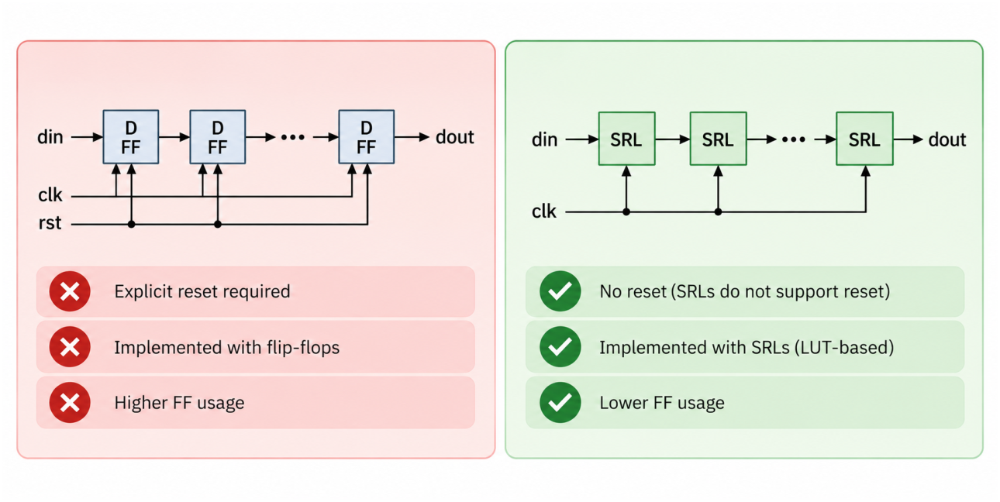 | 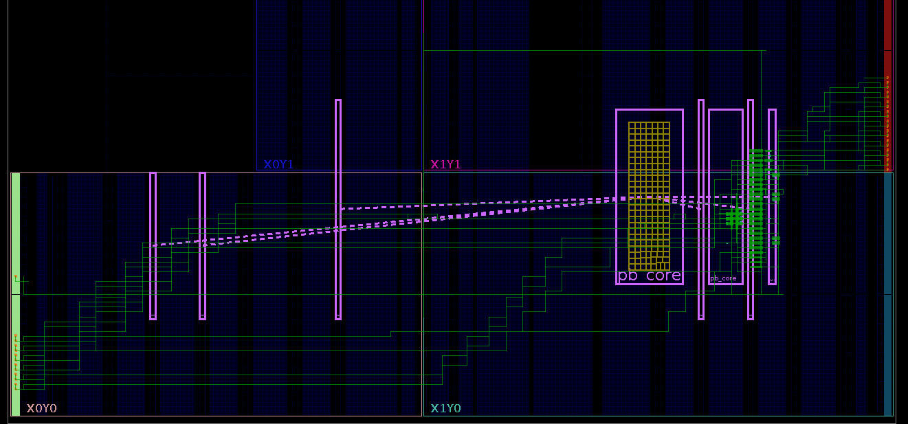 |

</details>

## Competition Deliverables Checklist

| Deliverable (per announcement) | Status |
|---|---|
| RTL source files | ✅ `rtl/` (7 modules) + `system/cnn_system.v` |
| Testbench | ✅ `tb/cnn_top_tb.v` + `system/cnn_system_tb.v` |
| Golden model | ✅ `python/golden_model.py` (pure Python 3) |
| Expected output files | ✅ `expected_outputs/` — 21 files, CI-regenerated |
| Input test images / feature maps | ✅ generated on-the-fly by the testbench (LFSR, ramp, worst-case corner stimuli) rather than shipped as image files |
| FPGA reports | ✅ `freq_sweep/` — 21 routed runs (timing / utilization / power / clocks) + summary CSV |
| Project report | ✅ `doc/AI_Accelerator_Report.pdf` |
| Competition announcement | ✅ `doc/2026_SSCS_Egypt_Competition_Announcement.pdf` |
| Edge-detection / inspection demo (optional bonus) | ✅ **Supported** — [demo/edge_detection_demo.py](demo/edge_detection_demo.py) loads the Sobel operators into the runtime-programmable kernel bank and ships the expected outputs for a 32×32 test scene |

## Project Structure

```text
.
├── .github/workflows/
│   └── golden-model.yml          # CI: regenerate golden vectors + bit-exact diff
├── rtl/                          # 7 synthesizable Verilog-2001 modules (top: cnn_top)
│   ├── cnn_top.v                 #   streaming convolution core top
│   ├── cnn_controller.v          #   fill / valid sequencing FSM
│   ├── kernel_coeff_memory.v     #   runtime-programmable kernel loader
│   ├── line_buffer.v             #   row delay line (DEPTH = IMG_WIDTH - N)
│   ├── window_nxn.v              #   N×N sliding window (instantiates line_buffer ×(N−1))
│   ├── tree_nxn.v                #   tap-delay + DSP48E1 MAC cascade (×NUM_KERNELS)
│   └── output_stage.v            #   optional ReLU + output gating (×NUM_KERNELS)
├── tb/
│   └── cnn_top_tb.v              # self-checking core testbench (golden-file comparison)
├── sim/                          # 21 ModelSim regression scripts + modelsim.ini
│   ├── run_3x32relu_k1.do        #   baseline regression (N=3 W=32 ReLU=1 K=1)
│   └── run_<N>x<W>[relu]_k<K>.do #   remaining 20 configurations
├── system/                       # BONUS system-level integration
│   ├── cnn_system.v              #   wrapper: local memories + start/busy/done FSM
│   ├── cnn_system_tb.v           #   system testbench
│   └── run.do                    #   system simulation script
├── demo/                         # BONUS edge-detection demonstration
│   ├── edge_detection_demo.py    #   Sobel Gx/Gy through the same fixed-point contract
│   ├── test_image_32x32.txt      #   deterministic 32×32 input scene
│   └── expected_sobel_*.txt      #   expected RTL outputs (raw + ReLU-clamped)
├── constrains/
│   └── timing_constraints.xdc    # 2.56 ns clock constraint, I/O settings
├── python/
│   └── golden_model.py           # pure-Python-3 golden reference model
├── expected_outputs/             # 21 golden output vector files (generated by golden_model.py)
├── freq_sweep/                   # Vivado MAX-FREQ characterization sweep (fixed 2.56 ns)
│   ├── max_freq_sweep.tcl        #   21-run synthesis + implementation batch script
│   ├── max_freq_results.csv      #   summary: LUT/FF/DSP/BRAM/power/WNS/FOM per run
│   └── runs/                     #   per-run clocks/timing/utilization/power reports
├── doc/
│   ├── AI_Accelerator_Report.pdf            # full project report
│   └── 2026_SSCS_Egypt_Competition_Announcement.pdf  # competition specification
├── images/                       # 25 evidence figures
├── _regress.log                  # 7/7 PASS RTL regression summary log
├── README.md
└── .gitignore
```

## How to Run

Prerequisites: **Python 3**, **ModelSim** (Intel FPGA Edition), **Xilinx Vivado**. All paths below are relative to the repository root.

### 1. Python golden model

```bash
cd python
python golden_model.py
```

Plain Python 3 — no third-party packages. Regenerates all 21 expected-output files in `expected_outputs/`.

### 2. RTL simulation (ModelSim)

```bash
cd sim
vsim -do run_3x32relu_k1.do
```

Each `run_*.do` script compiles `../rtl/*.v` and `../tb/cnn_top_tb.v` into `work`, then runs `work.cnn_top_tb` with `-g` parameter overrides (baseline: `-gN=3 -gIMG_WIDTH=32 -gRELU_EN=1 -gNUM_KERNELS=1 -gPIXEL_BITS=8`). The testbench loads its golden vectors from `expected_outputs/` and prints the RTL-vs-Python verdict. The other 20 scripts run the remaining configurations the same way.

### 3. System-level wrapper simulation

```bash
cd system
vsim -do run.do
```

Compiles the RTL plus `cnn_system.v` / `cnn_system_tb.v` and prints the system test verdict.

### 4. Vivado synthesis / implementation / reports (MAX-FREQ sweep)

```bash
cd freq_sweep
vivado -mode batch -source max_freq_sweep.tcl
```

Runs the complete 21-run sweep (7 configurations × `NUM_KERNELS` ∈ {1,2,3}): per run it reads `../rtl/*.v`, runs `synth_design -top cnn_top` with generics on **xc7z020clg400-1**, applies the fixed **2.56 ns** operating point, runs `opt_design → place_design → phys_opt_design → route_design`, and writes per-run timing/utilization/power/clock reports under `runs/`, plus the summary `max_freq_results.csv`.

### 5. Edge-detection demo (bonus)

```bash
cd demo
python edge_detection_demo.py
```

Loads the Sobel operators through the same fixed-point contract as the accelerator and regenerates the test image plus all four expected-output files (Sobel Gx/Gy, raw and ReLU-clamped).

### 6. Continuous integration

Every push that touches the golden model or expected outputs triggers the **Golden Model Verification** workflow: it regenerates all 21 vectors on GitHub Actions and fails unless they match the committed files bit-exactly (line-ending normalized). Status badge: top of this README.

## Reproducibility Notes

- **FPGA part:** xc7z020clg400-1, fixed in `max_freq_sweep.tcl` and in the checked-in reports.
- **Baseline parameters:** N=3, IMG_WIDTH=32, PIXEL_BITS=8, RELU_EN=1, NUM_KERNELS=1.
- **Tool versions:** the archived runs in this repository were produced with **Vivado v2019.1 (SW Build 2552052)** and **ModelSim – Intel FPGA Edition 2020.1** (per the run logs of the original project environment). The final report (`doc/AI_Accelerator_Report.pdf`) cites the **Vivado 2026** toolchain for the submission build. Both facts are stated as-is.
- **Source-controlled inputs:** all RTL, testbenches, sim/system scripts, the XDC, the Python golden model, all 21 golden expected-output files, the sweep TCL + CSV + per-run reports, the report PDF, the competition announcement, and the evidence images.
- **Generated artifacts** (ModelSim `work/` libraries, `*.wlf`, transcripts, Vivado journals/logs/backups) are intentionally **not** committed — they are rebuilt by the commands above and covered by `.gitignore`.
- **No Vivado `.xpr` projects are included.** The original `.xpr` files were stale — they referenced sources at a `../rtl_2/` directory that no longer exists — and were deliberately excluded. The headless flows above (`sim/*.do`, `system/run.do`, `freq_sweep/max_freq_sweep.tcl`) fully replace them.
- **What is reproducible from this repo:** golden-vector generation, all 21 RTL regressions, the system-wrapper test, and the full 21-run synthesis/implementation/report sweep. **What is not:** a one-click Vivado GUI project (not shipped), and board-level I/O timing (the XDC false-paths I/O by design).

## Tools & Technologies

| Tool | Role |
|---|---|
| Verilog-2001 | RTL (all 10 HDL files; no SystemVerilog constructs) |
| Python 3 | Golden reference model + golden-vector generation |
| ModelSim (Intel FPGA Edition) | RTL + system-level simulation |
| Xilinx Vivado | Synthesis, implementation, timing/utilization/power reports |
| Xilinx Zynq-7020 (xc7z020clg400-1) | Target FPGA; DSP48E1 MAC cascade |
| Tcl | Vivado batch sweep flow |
| GitHub Actions | Golden-model bit-exact regression CI |

## Team — FlipFlopers, Cairo University

| Name | GitHub | Email |
|---|---|---|
| Ahmed Badwy | [@ahmedbadwy77](https://github.com/ahmedbadwy77) | ahmed.badwy05@eng-st.cu.edu.eg |
| Ahmed Amir | [@ahmedamir10](https://github.com/ahmedamir10) | Ahmed.hamdy04@eng-st.cu.edu.eg |
| BadrEldin Hossam | [@Badreldin1salama](https://github.com/Badreldin1salama) | salamabadreldin@gmail.com |

## License

Distributed under the [MIT License](LICENSE).

## Documentation

- [`doc/AI_Accelerator_Report.pdf`](doc/AI_Accelerator_Report.pdf) — full design, verification, DSE, and results write-up.
- [`doc/2026_SSCS_Egypt_Competition_Announcement.pdf`](doc/2026_SSCS_Egypt_Competition_Announcement.pdf) — official competition specification.
